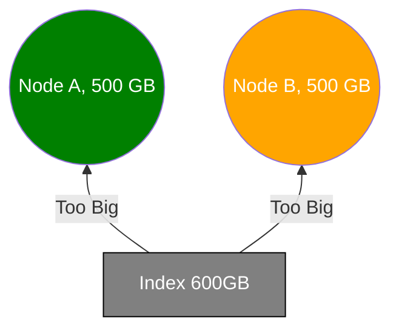
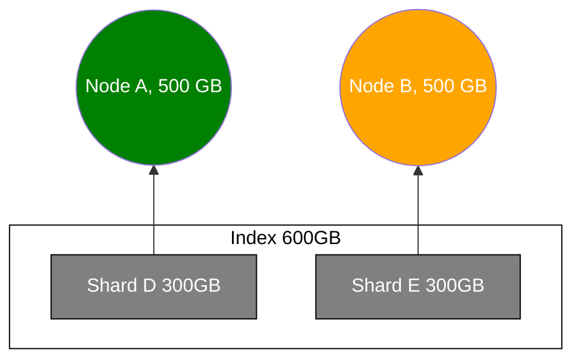
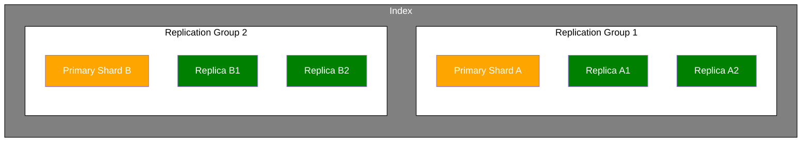
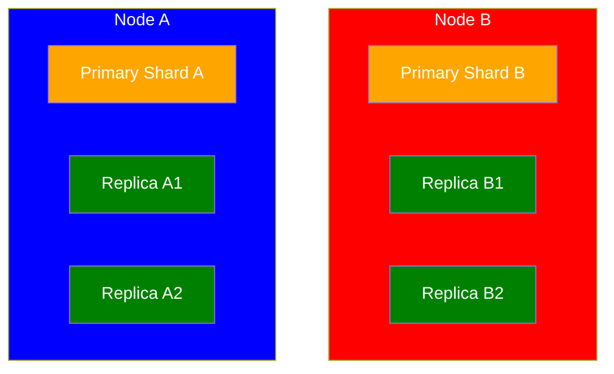

# Introduction

## Introduction to Elasticsearch

- **Elasticsearch**: an open source analytics and full-text search engine.
  - used for enabling search functionality for apps.
  - could query structured data such as numbers and aggregate data
  - could analyze structured data
  - could send events to Elasticsearch
    - e.g. sales, website clicks, phone calls, etc
  - excellent at analyzing lots of data
  - easy to use and highly scalable
  - **Anomality Detection**: detect and alert when there is a significant deviation from the normal behavior.
    - e.g. typical daily website visits is 50,000 but today it drops to 500
  - **Application Performance Management (APM)**: analyze application logs and system metrics
    - e.g. errors and CPU/memory usage
- Elasticsearch is written in Java and built on Apache Lucene

### How does Elasticsearch work?

- Data is stored as documents.
  - similar to rows in relational databases (e.g. MySQL)
- A document's data is separated into fields
  - similar to column's in relational databases
  - sort of like a json object
- To query documents, use a REST API.
- Queries sent to Elasticsearch are in JSON.

## Overview of Elastic Stack

### Kibana

- **Kibana**: an analytics and visualization platform, which lets you easily visualize data from Elasticsearch and analyze it to make sense of it.
  - analogy: kibana is like an Elasticsearch dashboard to create visualizations such as pie charts, line charts, etc. Kibana is a web interface to the data that is stored within Elasticsearch.
  - Configure change detection and forecasting in Kibana
  - Kibana can manage parts of Elasticsearch and Logstash such as:
    - Authentication
    - Authorization
  - Kibana can monitor CPU and memory usage to the number of application errors and API response times.
  - Kibana can have a dashboard with **KPIs (Key Points of Interest)**.

### Logstash

- **Logstash** is a tool to process logs from applications and send them to Elasticsearch.
  - Logstash is also a **data processing pipeline**.
  - The data that Logstash receives are handled as events.
    - e.g. log file entries, ecommerce orders, customers, chat messages

#### Logstash pipeline

Three stages, each use a plugin:

1. **Inputs** - Receive Events
   - Input plugin could be a file, HTTP, rows from a relational database, a Kafka queue, etc
2. **Filters** - Process Events
   - Filter plugin could parse csv, xml, json
   - **data enrichment** such as looking up an IP address to find geographical location.
3. **Outputs** - Send the processed events
   - Output plugin is where the processed events are sent to. Another name is **stashes**.

- In summary, Logstash receives events from one or more inputs, processes them, and sends them to one or more stashes.
- Logstash is horizontally scalable.
- A Logstash pipeline is defined in a proprietary markup format that is similar to JSON.
  - could add conditional statements to it and make a pipeline dynamic.
- Logstash can read the access logs from a web server line by line and process each line as an event.
  - Logstash receives the line as a text string, so need to parse this string to make some sense of it. In other words, need to structure this piece of unstructured data.

### X-Pack

- **X-Pack**: a pack of features that adds additional functionality to Elasticsearch and Kibana such as:
  - Security such as authentication and authorization.
  - Monitoring of performance, including Logstash.
    - Could see CPU/memory usage, disk space, etc.
  - Alerting of unusual events.
    - e.g. spikes in CPU/memory usage, application errors, suspicious logins, etc.
  - Reporting: generate reports of Kibana visualizations and dashboards as pdf or csv.
  - Machine Learning:
    - Detect abnormalities (e.g. unusual changes in data)
    - Forecast future values
  - Graph: relationships in the data
    - e.g. When someone views a product, show suggested related products, too.
    - e.g. Song suggestions on Spotify based on what you currently listen to.
    - Please don't confuse popularity and relevance.
      - e.g. Sample 10 people if they use Google. Those that say yes, cannot say much about what is common among them.
      - e.g. Sample 10 people that use stack overflow. Those that say yes, they probably know something about programming.
    - Graph plugin for Kibana to visualize data
  - Elasticsearch SQL: query documents with **Query DSL**, which is a JSON object defining the query.
    - Could send SQL queries over HTTP to Elasticsearch, which will translate it to Query DSL behind the scenes for you.
    - The Translate API returns the corresponding Query DSL.

### Beats

- **Beats**: a collection of data shippers that collect different kinds of data and serve different purposes. They are lightweight agents with a single purpose that you install on servers, which then send data to Logstash or Elasticsearch.
  - **Filebeat** is a beat used for collecting log files and sending the log entries off to either Logstash or Elasticsearch. Includes modules for common log types (e.g. nginx and MySQL).
  - **Metricbeat**: collects system-level and/or service metrics such as memory and CPU usage. Includes modules for common services (e.g. nginx and MySQL).
  - **Packetbeat**: collects network data. e.g. HTTP requests of database transactions
  - **Heartbeat**: Monitors service uptime

### Summary of Elastic Stack

- The center of this stack is Elasticsearch which contains the data.
- Ingesting data into Elasticsearch can be done with:
  - Beats
  - Logstash
  - through Elasticsearch's API
- Kibana is a user interface that visualizes the data it retrieves from Elasticsearch.
- X-pack enables additional features.

## ELK Stack

- **ELK Stack**: Elasticsearch + Logstash + Kibana

## Walkthrough of Common Architectures

### Ecommerce application example

- Data is stored in a relational database
  - Databases are not great at full-text searches
  - Use Elasticserach here
- Integration of Elastic search to this application by:
  - the application communicates with Elastic search
  - User Search Query --> request sent to web app --> Search query is sent to Elasticsearch
  - Could be done with HTTP official client libaries
  - When a new product is added or updated, add or update the product within Elasticsearch too.
    - Data duplication is okay stored in both DB and Elasticsearch.
- What if I have 100,000 prexisting product listings?
  - Need to write a script that imports data to Elasticsearch.
  - If there is too much, need to paginate the data

### Dashboard of number of orders, revenue, etc.

- Use Kibana which can be run on any machine and connect it to Elasticsearch

### Business Experiences High Growth

- Over time, the web traffic increases significantly
- We need to monitor server resources
  - Thus, use Metricbeat to monitor system level metrics such as CPU or memory usage.
  - Metricbeat is installed on the web server
- Configure Metricbeat to send data to Elasticsearch
- This data can now be visualized within Kibana
- Metricbeat ships with default Kibana dashboards
- The Kibana configuration is stored within Elasticsearch
- We want to monitor the access and error logs
  - Access logs tell us how long it took the web server to process each request
  - Response times can be monitored for each endpoint
  - Helps identiy bad deployments
  - Use Filebeat to have logs processed and stored within Elasticsearch
  - Filebeat ships with modules for common log file formats

### 2 more web servers added to business

- More kinds of data is added to Elasticsearch
- Need to do more advanced event processing
  - Don't want to do this within web app to clutter the business logic code because it might increase response time
  - Decentralized event processing.
  - Decreases the maintainability of the system
  - Goal to meet: Centralize event processing in one place
  - Achieve this goal with Logstash
- Logstash will process events and send them to Elasticsearch
- Event processing is now centralized within Logstash
- Could optionally centralize the data from Metricbeat and Filebeat to send to Logstash
- Ideally, all events go through Logstash.

## Elasticsearch vs OpenSearch

- Basically, Elastic vs AWS's OpenSearch
- Elasticsearch and Kibana license changes to ensure cloud providers collaborate with Elastic
- OpenSearch is controlled and developed by AWS

- The Core APIs between ElasticSearch and OpenSearch are the same:

  - Search Queries
  - Indexing Documents
  - Aggregations
  - Index Management
  - Basic Security
  - etc.

- ElasticSearch's vertical solutions:

  - SIEM
  - Observability
  - Enterprise Search
  - Machine Learning
  - etc.

- OpenSearch's vertical solutions:
  - Security Analytics
  - Observability
  - Machine Learning
  - etc.

## Understanding the Basic Architecture of Elasticsearch

- When you start up Elasticsearch, it starts up a node and a cluster.
  - A **node** is an instance of Elasticsearch that stores data.
  - You can run as many nodes as you want to store a lot of data.
  - Each node belongs to a cluster.
  - A **cluster** is a collection of related nodes that together contain all of our data.
  - Clusters are completely independent of each other by default.
- Each unit of data stored within your cluster is called a document.
  - **Documents** are JSON objects containing your data.
- When you index a document, the original JSON object that you sent to Elasticsearch is stored along with some metadata that Elasticsearch uses internally.
- Every document within Elasticsearch is stored within an index.
  - An index groups documents together logically, as well as provide configuration options that are related to scalability and availability.
  - An **index** is a collection of documents that have similar characteristics and are logically related.
  - An index may contain as many documents as you want, so there is no hard limit.
    :::note
    Search queries are run against indices.
    :::

:::note
Cloud deployments consist of multiple nodes by default to achieve high availability.
:::

## Sharding and scalability

- **Sharding** is a way to divide indices into smaller pieces
  - Each piece is called a **shard**.
  - Sharding is done at the index level
  - Purpose of sharding is to horizontally scale the data volume
  - A shard is somewhat an independent index
  - Each shard is an Apache Lucene index
  - An Elasticsearch index consists of one or more Lucene indices
  - A shard has no predefined size, it grows as documents are added to it.
  - A shard may store up to 2 billion documents

**Situation without sharding**:



- The whole index of 600 GB does not fit within either node of 500 GB.
- Thus, running the index on a single shard does not work.

**Situation in dividng the index into 2 shards**:



- A shard of 300GB can now fit into each node.
- You can have a higher number of shards, too, if desired. Just keep splitting up the index into smaller pieces.
- Any number of shards can go to any node.

### Purpose of Sharding

- Ability to store more documents
- To easier fit large indices onto nodes
- Improved performance
  - Parallelization of queries increases the throughput of an index

### Configuring the number of shards

- An index contains a single chard by default
- Increase the number of shards with the Split API
- Reduce the number of shards with the Split API

### Optimal number of shards

- It depends for your situation as many factors are involved
- Factors:
  - number of nodes and their capacity
  - number of indices and their sizes
  - number of queries
  - etc.
- Have a couple of shards for millions of documents.
- Stick to default of one shard for thousands of documents

## Understanding Replication

- Hardware can fail at any time, so need to handle it.
- Elasticsearch supports replication for fault tolerance.
- Replication is supported natively and enabled by default.
- With many databases, setting up replication can be a pain.
- Replication is extremely easy with Elasticsearch.
- Replication is configured at the index level
- Replication can increase availability and the throughput of a given index.
- **Replication** creates complete copies of shards called **replica shards**.
  - A replica shard can serve search requests
  - A replica shard cannot be allocated to the same node as the Primary Shard.
- **Primary Shard**: the master shard that has been replicated or copied.
- **Replication group** = primary shard + replica shards
- The number of replicas can be configured at index creation.
- Default number of replicas per shard is 1.

**Example Index**:





### Choosing the number of replica shards

- Ideal number of shards depends on use case
- For mission critical systems, downtime is not acceptable.
- Think if it is okay for data to be unavailable while you are trying to restore it.
  - If data loss is not a disaster, replicate shards once.
  - For critical systems, data should be replicated at least twice.
- By default, 1 primary shard and 1 replica shard is added to an index by default.

### Snapshots

- Elasticsearch supports taking snapshots as backups
- Snapshots used to restore to a given point in time
- Snapshots can be taken at the index level or for the entire cluster.
- Use snapshots for backups and replication for high availability and performance
  - If a mistake is made, could roll back to previous snapshot.

### Increasing query throughput with replication

- Replica shards of a replication group can serve different search requests simultaneously.
  - This increases the number of requests that can be handled at the same time.
- Elasticsearch intelligently routes requests to the best shard.
- CPU parallelizatoin improves performance if multiple replica shards are stored on the same node.

## Adding more Nodes to the Cluster in local environment

- [Delaying allocation when a node leaves](https://www.elastic.co/guide/en/elasticsearch/reference/current/delayed-allocation.html)

- Sharding enables us to scale an index's data volume
  - Need to add additional nodes...
  - Replication requires at least 2 nodes.

**second-node/config/elasticsearch.yml**

```
node.name: second-node
```

**third-node/config/elasticsearch.yml**

```
node.name: third-node
```

**Second Node**:

- Generate an enrollment token
  - In terminal: `cd elasticsearch`, then:
  ```
  bin/elasticsearch-create-enrollment-token --scope node
  ```
- Open another terminal window and `cd second-node`, then:
  ```
  bin/elasticsearch --enrollment-token ENTER_GENERATED_ENROLLMENT_TOKEN
  ```

**Third Node**:

- Generate an enrollment token
  - In terminal: `cd elasticsearch`, then:
  ```
  bin/elasticsearch-create-enrollment-token --scope node
  ```
- Open another terminal window and `cd third-node`, then:
  ```
  bin/elasticsearch --enrollment-token ENTER_GENERATED_ENROLLMENT_TOKEN
  ```

### Word of Caution

:::warning

- After adding a third node, at least 2 nodes are required to run the cluster.
  - If 2 nodes are lost, the cluster cannot elect a master node.
- If you want to run just a single node moving forward, don't add a third node.
  - Start fresh with a single-node cluster afterwards

:::

## Overview of Node roles

### Master-eligible Role

- The node may be elected as the cluster's master node
- A master node is responsible for creating and deleting indices, etc.
- A node with this role will not automatically become the master node
- May be used for having dedicated master nodes
  - useful for large clusters

### Data Role

- Enables a node to store data
- Storing data includes performing queries related to that data, such as search queries.
- For relatively small clusters, this role is always enabled.
- Useful for having dedicated master nodes.
- Used as part of configuring a dedicated master node.

### Ingest Role

- Enables a node to run ingest pipelines
- Ingest pipelines are a series of steps (processors) that are performed when indexing documents
  - Processors may manipulate documents
  - i.g. resolving an IP to lat/lon
- Similar to a simplified version of Logstash directly within Elasticsearch
- Useful for having dedicated ingest nodes

### Machine Learning Role

- `node.ml` identifies a node as a machine learning node
  - Lets the node to run machine learning jobs
- `xpack.ml.enabled` enables or disables the machine learning API for the node.
- Useful for running ML jobs that don't affect other tasks

### Coordination Role

- Coordination refers to the distribution of queries and the aggregation of results
- Useful for coordination-only nodes (for large clusters)
- Configured by disabling all other roles

### Voting-only Role

- Rarely used
- A node that will participate in the voting for a new master node
- The node cannot be elected as the master node itself
- Only used for large clusters

### Kibana Dashboard

`GET /_cat/nodes?v`

Output --> Column Name: `node.role`

- e.g. `dim` means:
  - data
  - ingest
  - master
- these values are usually default

### When to change node roles

- depends on situation
- useful for large clusters
- typically done when optimizing the cluster to scale the number of requests.
- Change other things first:
  - number of nodes
  - number of shards
  - number of replica shards
- Better understand what hardware resources are used for
- Only change roles if you know what you are doing
