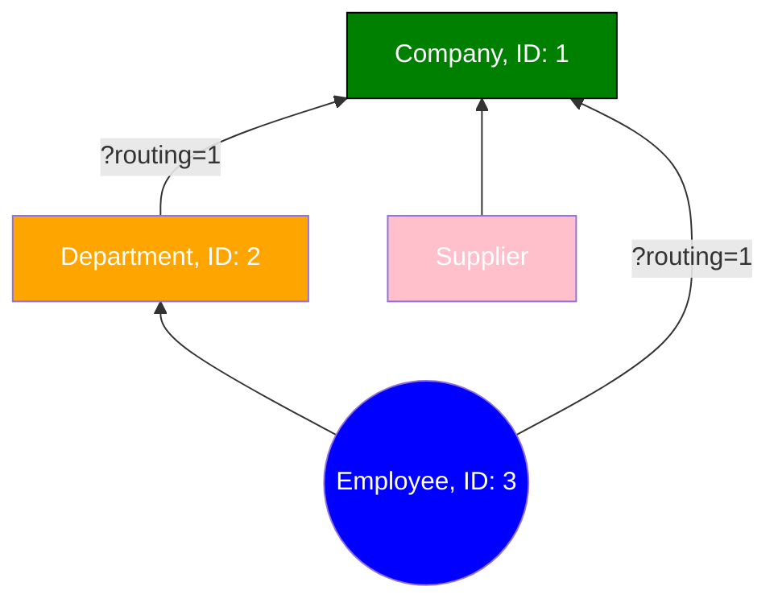

# Joining Queries

:::tip
Don't use Elasticsearch as a primary data store

Optimize search performance by denormalizing data

Performance > disk space
:::

:::note
Elasticsearch only supports simple joins

Joins are expensive
:::

## Mapping document relationships

- Define document relationships by first defining them in the mapping.
- Join documents using a join field.
  - Join field defines the relations between the types of documents that are part of the document hierarchy.

```
PUT /department
{
    "mappings": {
        "_doc": {
            "properties": {
                "join_field": {
                    "type": "join",
                    "relations": {
                        "department": "employee"
                    }
                }
            }
        }
    }
}
```

:::note
`department` is the parent of `employee`
:::

## Adding documents

```
PUT /department/_doc/1
{
    "name": "Development",
    "join_field": "department"
}

PUT /department/_doc/2
{
    "name": "Marketing",
    "join_field": "department"
}

PUT /department/_doc/3
{
    "name": "Bo Anderson",
    "age": 28,
    "gender": "M",
    "join_field": {
        "name": "employee",
        "parent": 1
    }
}
```

## Querying by parent ID

```
GET /department/_search
{
    "query": {
        "parent_id": {
            "type": "employee"
            "id": 1
        }
    }
}
```

## Querying child documents by parent

- [Has parent query docs](https://www.elastic.co/guide/en/elasticsearch/reference/current/query-dsl-has-parent-query.html#_sorting_2)

```
GET /department/_search
{
    "query": {
        "has_parent": {
            "parent_type": "department",
            "score": true,
            "query": {
                "term": {
                    "name.keyword": "Development"
                }
            }
        }
    }
}
```

## Querying parent by child documents

- [Had child query docs](https://www.elastic.co/guide/en/elasticsearch/reference/current/query-dsl-has-child-query.html#_sorting)

```
GET /department/_search
{
    "query": {
        "has_child": {
            "type": "employee",
            "score_mode": "sum",
            "query": {
                "bool": {
                    "must": [
                        {
                            "range": {
                                "age": {
                                    "gte": 50
                                }
                            }
                        }
                    ],
                    "should": [
                        {
                            "term": {
                                "gender.keyword": "M"
                            }
                        }
                    ]
                }
            }
        }
    }
}
```

- min score mode: The lowest score of matching child documents is mapped into the parent
- max score mode: The highest score of matching child documents is mapped into the parent
- sum score mode: The matching children's scores are summed up and mapped into the parent
- avg score mode: The average score based on matching child documents is mapped into the parent

## Multi-level relations

```
PUT /company
{
    "mappings": {
        "_doc": {
            "properties": {
                "join_field": {
                    "type": "join",
                    "relations": {
                        "company": ["department", "supplier"],
                        "department": "employee"
                    }
                }
            }
        }
    }
}
```



```
PUT /company/_doc/1
{
    "name": "My Company Inc",
    "join_field": "company"
}

PUT /company/_doc/2?routing=1
{
    "name": "Development",
    "join_field": {
        "name": "department",
        "parent": 1
    }
}

PUT /company/_doc/3?routing=1
{
    "name": "Bo Anderson",
    "join_field": {
        "name": "employee",
        "parent": 2
    }
}

GET /company/_search
{
    "query": {
        "has_child": {
            "type": "department",
            "query": {
                "has_child": {
                    "type": "employee",
                    "query": {
                        "term": {
                            "name.keyword": "John Doe"
                        }
                    }
                }
            }
        }
    }
}
```

## Parent / Child Inner Hits

```
GET /department/_search
{
    "query": {
        "has_parent": {
            "parent_type": "department",
            "inner_hits": {}
            "query": {
                "term": {
                    "name.keyword": "Development
                }
            }
        }
    }
}
```

:::note
By including inner hits within the results, we can see which department cost each employee to match.

In other words, we can tell which parent document cost a given child document to be returned.
:::

## Terms lookout mechanism

```
GET /stories/_search
{
    "query": {
        "terms": {
            "user": {
                "index": "users",
                "type": "_doc",
                "id": 1,
                "path": "following"
            }
        }
    }
}
```

:::note
The more terms, the slower the query
:::

## Join Limitations

- The documents that are joining must be stored within the same index.
- Parent and child documents must be on the same shard
- Only one join field per index
  - A join field can have as many relations as you want
  - New relations can be added after creating the index
- Child relations can only be added to existing parents
- A document can only have one parent
  - e.g. an employee can only work under one department
- A document can have multiple children
  - e.g. a department can have multiple employees

## Join Field Performance Considerations

- Join Fields are slow
- Avoid join fields whenever possible, except a few scenarios
  - A one to many relationship between 2 document types, where one type has many more documents than the other
  - e.g. recipes as parent documents and ingredients as child documents is a good scenario for join fields since there are more ingredients than recipes
- The more child documents pointing to unique parents, the slower the `has_child` query is
  - Basically the more documents, the slower the query
- The number of parent documents slows down the `has_parent` query
- Each level of document relations adds an overhead to queries

:::tip

- In the general sense, it is recommended to not map document relationships
- Denormalize data instead of mapping document relationships

:::
