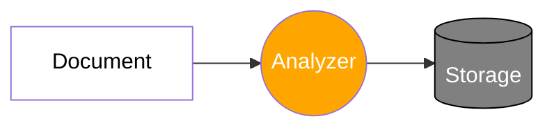

# Mapping and Analysis

## Intro to Analysis

- Aka **text analysis**
  - Applies to text fields / values
  - Text values are analyzed when indexing documents
  - The result is stored in data stuctures that are efficient for searching

:::info

- The `_source` object is not used when searching for documents
  - It contains the exact values specified when indexing a document

:::



- An **Analyzer** is made of:
  1. **Character Filters**: receives the original text and adds, removes, or changes characters.
  - Zero or more character filters can be present
  - Character filters are applied in the order in which they are specified
  - e.g. remove html tags and only keep the text
  2. **Tokenizer**: tokenizes a string, meaning split the text into tokens
  - There can only be one tokenizer
  - Characters could be removed such as punctuation
  - e.g. Split a sentence word by word and remove punctuation and white spaces
  3. **Token Filters**: receive the output of the tokenizer as input (the tokens)
  - could add, remove, or modify tokens
  - zero or more token filters can be present
  - Token filters are applied in the order in which they are specified
  - e.g. lowercase all the tokens

## Using the Analyze API

- Open up localhost Kibana Console
- Compare this query:

```SQL
POST /_analyze
{
    "text": "1 random sentence     in the air, but then the... PUPPIES :0"
    "analyzer": "standard"
}
```

to this query:

```SQL
POST /_analyze
{
    "text": "1 random sentence     in the air, but then the... PUPPIES :0"
    "char_filter": [],
    "tokenizer": "standard",
    "filter": ["lowercase"]
}
```

:::note
These two queries have the same output!

An `analyzer` is broken up into three parts: `char_filter`, `tokenizer`, and `filter`.
:::

## Understanding inverted indices

- A field's values are stored in one of several data structures
  - The data structure depends on the field's data type
- Ensures efficient data access (e.g. searches)
- Handled by Apache Lucene, not Elasticsearch
- **Inverted Indices**: mapping between terms and which documents contain them
  - terms are the tokens emitted by the analyzer
  - terms are sorted alphabetically for performance reasons
- Inverted indices enable fast searches
- Inverted indices contain more than just terms and document IDs
  - information for relevance scoring
- One inverted index per text field
- Other data types like numeric, date, etc use BKD trees

## Introduction to mapping

- **Mapping** defines the structure of documents (fields and their data types)
  - used to configure how values are indexed
- Analogy --> a table schema in a relational database
- **Explicit Mapping** define field mappings ourselves
- **Dynamic mapping**: elasticsearch generates field mappings for us

## Overview of data types

- [Field Data Types Documentation](https://www.elastic.co/guide/en/elasticsearch/reference/current/mapping-types.html)

### Object data type

- used for any JSON object
- objects may be nested
- Mapped using the `properties` parameter
- Objects are not stored as objects in Apache Lucene
  - Objects are transformed to ensure that we can index any valid JSON

### Nested data type

- Similar to the `object` data type but maintains object relationships
  - Useful when indexing arrays of objects
- Enables us to query objects independently
  - Must use the `nested` query
- `nested` objects are stored as hidden documents

### Keyword data type

- Used for exact matching of values
- Used for filtering, aggregations, and sorting
- e.g. searching for articles with a status of `PUBLISHED`
- For full-text searches, use the `text` data type instead
  - e.g. searching the body text of an article

## How the keyword data type works

- `keyword` fields are analyzed with the `keyword` analyzer
- The `keyword` analyzer is a no-op analyzer
  - It outputs the unmodified string as a single token
  - This token is placed into the inverted index
- `keyword` fields are used for exact matching, aggregations, and sorting
- Example:

```SQL
POST /_analyze
{
    "text": "1 random sentence     in the air, but then the... PUPPIES :0"
    "analyzer": "keyword"
}
```

:::info
The output will contain a single token with the text string completely untouched.
:::

## Understanding type coercion

- Data types are inspected when indexing documents
  - They are validated and some valid values are rejected
  - e.g trying to index an object for a `text` field
- Sometimes, providing the wrong data type is okay

```SQL
PUT /coercion_test/_doc/1
{
    "price": 7.4
}

PUT /coercion_test/_doc/1
{
    "price": "7.4"
}

PUT /coercion_test/_doc/1
{
    "price": "7.4m"
}
```

:::note
For the second PUT, it passes in a string `"7.4"` which does not match the type `float` in the mapping.

Elasticsearch will actually convert the string if it only contains numbers into the `float` type.

For the third PUT, it fails because the string contained a letter `m` along with `7.4`, so it could not be converted to `float` type.
:::

### Understanding the `__source` object

- Contains the values that were supplied at index time
  - e.g. contains `"7.4"` and not the values that are indexed (`7.4`)
- Search queries use indexed values, not `_source`
  - BKD trees, inverted indices, etc
- `_source` does not reflect how values are indexed

:::tip

- Keep coercion in mind if you use values from `__source`

:::

### More on Coercion

- Supplying a floating point for an `integer` field will truncate it to an integer
- Coercion is not used for dynamic mapping
  - Supplying "7.4" for a new field will create a text mapping
- Always try to use the correct data type
  - Especially the first time you index a field
- Coercion is enabled by default
  - Could disable it

## Understanding arrays

- There is no such things as an array data type
- Any field may contain zero or more values
  - No configuration or mapping needed
  - Simply supply an array when indexing a document
- Constraints:
  - Array values should be of the same data type
  - Coercion only works for fields that are already mapped
    - If creating a field mapping with dynamic mapping, an array must contain the same data type.

**Array Example**:

```SQL
POST /_analyze
{
    "text": ["Strings are simply", "merged together."],
    "analyzer": "standard"
}
```

:::note
Looking at the output, the multiple strings are treated as a single string and not as multiple values.
:::

### Nested Arrays

- Arrays may contain nested arrays
- Arrays are flattened during indexing
- `[1, [2, 3]]` becomes `[1, 2, 3]`

:::info
Remember to use the `nested` data type for arrays of objects if you need to query the objects independently.
:::

## Adding explicit mappings

```SQL
PUT /reviews
{
    "mappings": {
        "properties": {
            "rating": { "type": "float" },
            "content": { "type": "text" },
            "product_id": { "type": "integer" },
            "author": {
                "properties": {
                    "first_name": { "type": "text" },
                    "last_name": { "type": "text" },
                    "email": { "type": "keyword" }
                }
             }
        }
    }
}
```

## Retrieving Mappings

```SQL
GET /reviews/_mapping

GET /reviews/_mapping/field/content

GET /reviews/_mapping/field/author.email
```

## Using dot notation in field names

```SQL
PUT /reviews
{
    "mappings": {
        //...

        "author":{
            "properties": {
                "first_name": { "type": "text" },
                "last_name": { "type": "text" },
                "email": { "type": "keyword" }
            }
        }
    }
}
```

can be converted to dot notation:

```SQL
PUT /reviews
{
    "mappings": {
        //...

        "author.first_name": { "type": "text" },
        "author.last_name": { "type": "text" },
        "author.email": { "type": "keyword" }
    }
}
```

## Adding mappings to existing indices

- **`created_at` timestamp custom mapping Example**:

```SQL
PUT /reviews/_mapping
{
    "properties": {
        "created_at": {
            "type": "date"
        }
    }
}
```

## How dates work in Elasticsearch

- specified in one of 3 ways
  - specially formatted strings
  - ms since the epoch (`long`)
  - seconds since the epoch (`integer`)
- Epoch refers to the 1st of January 1970
- Custom formats are supported

### Default behavior of date fields

- 3 formats:
  - A date without time
  - A date with time
  - ms since the epoch
- UTC timezone assumed if none is specified
- Dates must be formatted according to the ISO 8601 spec

### How `date` fields are stored

- Stored internally as ms since the epoch
- Any valid value that you supply at index time is converted to a long value internally
- Dates are converted to UTC timezone
- The same date conversion happens for search queries, too

:::warning
Don't provide UNIX timestamps for default date fields
:::

## How missing fields are handled

- All fields in Elasticsearch are optional
- You can leave out a field when indexing documents
- Some integrity checks need to be done at the application level
  - e.g. have required fields
- Adding a field mapping does not make a field required
- Searches automatically handle missing fields

## Overview of mapping parameters

- [Mapping Parameters](https://www.elastic.co/guide/en/elasticsearch/reference/current/mapping-params.html)
- [format documentation](https://www.elastic.co/guide/en/elasticsearch/reference/current/mapping-date-format.html)

### `format` parameter

- Used to customize the format for `date` fields
  - Recommended to use default format: `strict_date_optional_time||epoch_millis`
- Using Java's `DateFormatter` syntax:
  - e.g. `"dd/MM/yyyy"`
- Using built-in formats
  - e.g. "`epoch_second`"

### `properties` parameter

- Define nested fields for `object` and `nested` fields

Example:

```SQL
PUT /sales
{
  "mappings": {
    "properties": {
      "sold_by": {
        "properties": {
          "name": { "type": "text" }
        }
      }
    }
  }
}
```

### `coerce` parameter

- Used to enable or diable coercion of values (enabled by default)

Example:

```SQL
PUT /sales
{
  "mappings": {
    "properties": {
      "amount": {
        "type": "float",
        "coerce": false
      }
    }
  }
}
```

Example of disabling coercion at the index field to not tediously add coercion to every field:

```SQL
PUT /sales
{
  "settings": {
    "index.mapping.coerce": false
  },
  "mappings": {
    "properties": {
      "amount": {
        "type": "float",
        "coerce": true
      }
    }
  }
}
```

:::note

The "amount" field overwrites the index level coerce value of `false`.

:::

### Introduction to `doc_values`

- Elasticsearch makes use of several data structures
  - No single data structure serves all purposes
- Inverted indices are excellent for searching text
  - They don't perform well for many other data access patterns
- "Doc Values" is another data structure used by Apache Lucene
  - Optimized for a different data access pattern (document --> terms)
- `doc_values` are an "uninverted" inverted index.
  - used for sorting, aggregations, and scripting
  - could be used along side inverted indices
  - Elasticsearch automatically queries the appropriate data structure

### Disabling `doc_values`

- Set the `doc_values` parameter to `false` to save disk space
  - slightly increases the indexing throughput
- Only disable doc values if you won't use aggregations, sorting, scripting
- Particularly useful for large indices; typically not worth it for small ones
- Cannot be changed without reindexing documents into new index.
  - Use with caution and try to anticipate how fields will be queried

Example:

```SQL
PUT /sales
{
  "mappings": {
    "properties": {
      "buyer_email": {
        "type": "keyword",
        "doc_values": false
      }
    }
  }
}
```

### `norms` parameter

- Normalization factors used for relevance scoring
- Norms refers to the storage of various normalization factors that are used to compute relevance scores.
- Want to rank results as we filter them
- Norms can be disabled to save disk space
  - Disable norms for fields that won't be used for relevance scoring

Example:

```SQL
PUT /products
{
  "mappings": {
    "properties": {
      "tags": {
        "type": "text",
        "norms": false
      }
    }
  }
}
```

### `index` parameter

- Disables indexing for a field
- Values are still stored within `__source`
- Useful if you won't use a field for search queries
- Saves disk space and slightly improves indexing throughput
- Often used for time series data
- Fields with indexing disabled can still be used for aggregations

Example:

```SQL
PUT /server-metrics
{
  "mappings": {
    "properties": {
      "server_id": {
        "type": "integer",
        "index": false
      }
    }
  }
}
```

### `null_value` parameter

- `NULL` values cannot be indexed or searched
- Use this parameter to replace `NULL` values with another value
- Only works for explicity `NULL` values
- The replacement value must be of the same data type as the field
- Does not affect the value stored within `__source`

```SQL
PUT /sales
{
  "mappings": {
    "properties": {
      "partner_id": {
        "type": "keyword",
        "null_value": "NULL"
      }
    }
  }
}
```

### `copy_to` parameter

- Used to copy multiple field values into a "group field"
- Simply specify the name of the target field as the value
- Example: `first_name` and `last_name` --> `full_name`
- Values are copied, not terms/tokens
  - The analyzer of the target field is used for the values
- The target field is not part of `__source`

Example:

```SQL
PUT /sales
{
  "mappings": {
    "properties": {
      "first_name": {
        "type": "text",
        "copy_to": "full_name"
      },
      "last_name": {
        "type": "text",
        "copy_to": "full_name"
      },
      "full_name": {
        "type": "text"
      }
    }
  }
}
```

## Updating existing mappings

- Suppose that product IDs may now include letters
- We need to change the `product_id` field's data type to either `text` or `keyword`
  - We won't use the field for full-text searches
  - We will use it for filtering, so the `keyword` data type is ideal

### Limitations for updating mappings

- Elasticsearch field mappings cannot be changed.
- Could add new field mappings
- A few mapping parameters could be updated for existing mappings
- Being able to update mappings would be problematic for existing documents
  - Text values have already been analyzed, for instance
  - Changing between some data types would require rebuilding the whole data structure
- Even for an empty index, we cannot update a mapping
- Field mappings cannot be removed
  - Just leave out the field when indexing documents
- The Update By Query API can be used to reclaim disk space
- The solution is to reindex documents into a new index

## Reindexing documents with the Reindex API

- [Reindex API](https://www.elastic.co/guide/en/elasticsearch/reference/current/docs-reindex.html) moves documents from one index to another so that we don't have to

```SQL
POST /_reindex
{
  "source": {
    "index": "reviews"
  },
  "dest": {
    "index": "reviews_new"
  }
}
```

### `__source` data types

- The data type doesn't reflect how the values are indexed
- `__source` contains the field values supplied at index time
- It's common to use `__source` values from search results
  - expect a string for a `keyword` field
- modify the `__source` value while reindexing
- Can be handled at the application level

```SQL
POST /_reindex
{
  "source": {
    "index": "reviews"
  },
  "dest": {
    "index": "reviews_new"
  },
  "script": """
    if(ctx.__source.product_id != null) {
      ctx._source.product_id = ctx._source.product_id.toString();
    }
  """
}
```

### Reindex documents matching a query

```SQL
POST /_reindex
{
  "source": {
    "index": "reviews",
    "query": {
      "match_all": { }
    }
  },
  "dest": {
    "index": "reviews_new"
  }
}
```

:::note
The above code specifies a query within the "source" parameter to only reindex documents that match the query.
:::

### Reindex only positive reviews

```SQL
POST /_reindex
{
  "source": {
    "index": "reviews",
    "query": {
      "range": {
        "rating": {
          "gte": 4.0
        }
      }
    }
  },
  "dest": {
    "index": "reviews_new"
  }
}
```

### Removing fields

- Field mappings cannot be deleted
- Fields can be left out when indexing documents
- Maybe we want to reclaim disk space used by a field
  - Already indexed values still take up disk space
  - For large data sets, this may be worthwhile
    - Assuming that we no longer need the values

Example:

```SQL
POST /_reindex
{
  "source": {
    "index": "reviews",
    "__source": ["content", "created_at", "rating"]
  },
  "dest": {
    "index": "reviews_new"
  }
}
```

:::note

- By specifying an array of field names, only those fields are included for each document when they are indexed into the destination index.
- In other words, any fields that you leave out will not be reindexed.

:::

### Changing a field's name

```SQL
POST /_reindex
{
  "source": {
    "index": "reviews",
  },
  "dest": {
    "index": "reviews_new"
  },
  "script": {
    "source": """
    # Rename "content" field to "comment"
    ctx.__source.comment = ctx.__source.remove("content");
    """
  }
}
```

- Example: Ignore reviews with ratings below 4.0

```SQL
POST /_reindex
{
  "source": {
    "index": "reviews",
  },
  "dest": {
    "index": "reviews_new"
  },
  "script": {
    "source": """
      if(ctx.__source.rating < 4.0){
        ctx.op = "noop" # can also be set to "delete"
      }
    """
  }
}
```

:::note
For `"noop"` value, the document will not be indexed into the destination index.
:::

### Using `ctx.op` within scripts

- Usually, using the `query` parameter is possible
- For more advanced use cases, `ctx.op` can be used
- Using the query parameter is better performance wise and is preferred
- Specifying `"delete"` deletes the document within the destination index
  - The destination index might not be empty as in our example
  - The same can be done with the Delete by Query API

### Parameters for the Reindex API

- A snapshot is created before reindexing documents
- A version conflict causes the query to be aborted by default
- The destination index is not empty

### Batching & Throttling

- The Reindex API performs operations in batches
  - Similar to the Update by Query and Delete by Query Applies
  - It uses the Scroll API internally
  - This is how millions of documents can be reindexed efficiently
- Throttling can be configured to limit the performance impact
  - Useful for production clusters

## Defining field aliases

- Field names can be changed when reindexing documents
  - Not worth it for lots of document
- Alternative: use **field aliases**
  - Doesn't require documents to be reindexed
  - Aliases can be used within queries
  - Aliases are defined with a field mapping

```SQL
POST /_reindex/_mapping
{
  "properties": {
    "comment": {
      "type": "alias",
      "path": "content"
    }
  }
}
```

### Updating field aliases

- Field Aliases could be updated
  - Only its target field though
- Simply perform a mapping update with a new path value
- Possible because aliases don't affect indexing
  - It's a query-level construct

### Index Aliases

- Elasticsearch also supports Index Aliases
- Used when dealing with large data volumes

## Multi-field mappings

```SQL
PUT /multi_field_test
{
  "mappings": {
    "properties":{
      "description": {
        "type": "text"
      },
      "ingredients": {
        "type": "text",
        "fields": {
          "keyword": {
            "type": "keyword"
          }
        }
      }
    }
  }
}
```

## Index Templates

- [Index Templates API](https://www.elastic.co/guide/en/elasticsearch/reference/current/indices-put-template.html)
- A way to automatically apply settings and mappings on index creation
  - Works by matching index names against an **index pattern**
- Only a single index template can be applied to a new index
- Used for data sets that are stored in multiple indices
  - e.g time series data
- Enables us to simply index documents into indices that don't already existing
- Indices can be created manually
  - API request and index templates are merged (the request takes precedence)

### Structure of index Templates

```SQL
PUT /_index_template/my-index-template
{
  "index_patterns": ["my-index-pattern*"],
  "template": {
    "settings": { ... },
    "mappings": { ... }
  }
}
```

:::note

- `PUT /_index_template/my-index-template` is the name of the index template
- `"index_patterns": ["my-index-pattern*"]` is a pattern that determines when the index template is applied
- `"settings": { ... },` is settings to apply to the new index
- `"mappings": { ... }` is field mappings to add to the new index

:::

### Priorities

- Index patterns cannot overlap by default
- Only a single index template can be applied to a new index
- Specify a `priority` paramter to handle overlapping index patterns
  - Defaults to zero
  - The index template with the highest priority "wins"

## Introduction to dynamic mapping

- JSON `String` --> Elasticsearch (`text` field with `keyword` mapping, `date` field, `float` field or `long` field)
- JSON `Integer` --> Elasticsearch `long`
- JSON `Floating point` number --> Elasticsearch `float`
- JSON `array` --> Depends on the first non-null value

## Configuring dynamic mapping

```SQL
PUT /people
{
  "mappings": {
    "dynamic": false,
    "properties": {
      "first_name": {
        "type": "text"
      }
    }
  }
}
```

### Setting `dynamic` to `false`

- New fields are ignored
  - They are not indexed, but still part of `__source`
- No inverted index is created for the `last_name` field
  - Querying the field gives no results
- Fields cannot be indexed without a mapping
  - When enabled, dynamic mapping creates one before indexing values

### Setting `dynamic` to `strict`

- Elasticsearch will reject unmapped fields
  - All fields must be mapped explicitly
  - Similar behavior as relational databases

```SQL
PUT /people
{
  "mappings": {
    "dynamic": false,
    "properties": {
      "first_name": {
        "type": "text"
      }
    }
  }
}
```

### Numeric Detection

```SQL
PUT /computers
{
  "mappings": {
    "numeric_detection": true
  }
}
```

:::note
When adding a doc, if the field values are string versions of numbers, dynamic mapping will set values to long or float.
:::

## Dynamic Templates

```SQL
PUT /dynamic_template_test
{
  "mappings": {
    "dynamic_templates": [
      "integer": {
        "match_mapping_type": "long",
        "mapping": {
          "type": "integer"
        }
      }
    ]
  }
}
```

### `match` and `unmatch` parameters

- used to specify conditions for field names
- Field names must match the condition specified by the `match` parameter
- `unmatch` is used to exclude fields that were matched by the `match` parameter
- Both parameters support patterns with wildcards(\*)

### `path_match` and `path_unmatch` parameters

- These parameters evaluate the full field path
  - i.e. not just the field names
- dot notation
  - `name.first_name`
- wildcards are supported

### Index templates vs dynamic templates

- Index templates apply mappings and index settings for matching indices
  - This happens when indices are created and their names match a pattern
- Dynamic templates are evaluated when new fields are encountered
  - and dynamic mapping is enabled
  - The specified field mapping is added if the templates conditions match
- Index templates define fixed mappings; dynamic templates are dynamic

## Mapping Recommendations

- Dynamic mapping is convenient, but not good for production
- Use explicit mappings
  - Save disk space with optimized mappings with storing many documents
  - set `dynamic` to `strict`, not `false`, to avoid surprises and unexpected results

### Mapping of text fields

- Don't always map strings as both `text` and `keyword`
  - Typically only one is needed
  - Each mapping requires disk space
- Do you need to perform full-text searches?
  - Add a `text` mapping
- Do you need to do aggregations, sorting, or filtering on exact values?
  - Add a `keyword` mapping

### Disable Coercion

- Coercion forgives you for doing the wrong thing
- Do things correctly instead
  - Always use the correct data types

### Use appropriate numeric data types

- For whole numbers, the `integer` data type might be enough
  - `long` can store larger numbers, but also uses more disk space
- For decimal numbers, the `float` data type might be precise enough
  - `double` stores numbers with a higher precision but uses 2x disk space
  - Usually, `float` provides enough precision

### Mapping parameters

- Set `doc_values` to `false` if you don't need sorting, aggregations, and scripting
- Set `norms` to `false` if you don't need relevance scoring
- Set `index` to `false` fi you don't need to filter on values
  - You can still do aggregations (e.g. for time series data)
- Only worth the effort when storing lots of documents
- Worse case scenario, need to reindex documents

### Stemming & Stop words

- **Stemming** reduces words to their root format
  - e.g. `loved` --> `love`
  - e.g. `drinking` --> `drink`
- **Stop Words**: words that are filtered out during text analysis
  - Common words such as "a", "the", "at", "of", "on", etc.
- They provide little to no value for relevance scoring
- Fairly common to remove such words
- Not removed by default, and generally not recommended to do so

## Built-in Analyzers

- [Built-in Analyzers Docs](https://www.elastic.co/guide/en/elasticsearch/reference/current/analysis-analyzers.html)

:::note

The main example we will be looking at is:

```
"Is that Peter's cute-looking dog?"
```

:::

### `standard` analyzer

- Splits text at word boundaries and removes punctuation
  - Done by the `standard` tokenizer
- Lowercases letters with the `lowercase` token filter
- Contains the `stop` token filter (disabled by default)
- Example after standard analyzer:

```
["is", "that", "peter's", "cute", "looking", "dog"]
```

### `simple` analyzer

- similar to the `standard` analyzer
  - splits into tokens when encountering anything else than letters
- Lowercases letters with the `lowercase` tokenizer
  - Unusual and a performance hack
- Example after simple analyzer:

```
["is", "that", "peter", "s", "cute", "looking", "dog"]
```

### `whitespace` analyzer

- Splits text into tokens by whitespace
- Does not lowercase letters
- Example after whitespace analyzer:

```
["Is", "that", "Peter's", "cute-looking", "dog?"]
```

### `keyword` analyzer

- No-op analyzer that leaves the input text intact
  - outputs it as a single token
- Used for `keyword` fields by default
  - Used for exact matching
- Example after keyword analyzer:

```
["Is that Peter's cute-looking dog?"]
```

### `pattern` analyzer

- A regular expression is used to match token separators
  - It should match whatever should split the text into tokens
- This analyzer is very flexible
- The default pattern matches all non-word characters (\W+)
- Lowercases letters by default
- Example after pattern analyzer

```
["is", "that", "peter", "s", "cute", "looking", "dog"]
```

## Custom Analyzers

- [Text Analysis Docs](https://www.elastic.co/guide/en/elasticsearch/reference/current/analysis.html)

- Example:

```SQL
PUT /analyzer_test
{
  "settings": {
    "analysis": {
      "analyzer": {
        "my_custom_analyzer": {
          "type": "custom",
          "char_filter": ["html_strip"],
          "tokenizer": "standard",
          "filter": [
            "lowercase",
            "stop",
            "asciifolding"
          ]
        }
      }
    }
  }
}
```

## Adding Analyzers to existing indices

```SQL
// Any attempt to search or index documents will be refused
// while the index is in the closed state
PUT /analyzer_test/_close

PUT /analyzer_test/_settings
{
  "analysis": {
      "analyzer": {
        "my_second_analyzer": {
          "type": "custom",
          "char_filter": ["html_strip"],
          "tokenizer": "standard",
          "filter": [
            "lowercase",
            "stop",
            "asciifolding"
          ]
        }
      }
  }
}

// the index is in the open state
// now able to use the analyzer within field mappings
PUT /analyzer_test/_open
```

### Open & Closed Indices

- An open index is available for indexing and search requests
- A closed index will refuse requests
  - Read and write requests are blocked
  - Necessary for performing some operations

### Dynamic and static settings

- Dynamic settings can be changed without closing the index first
  - Requires no downtime
- Static settings require the index to be closed first
  - The index will be briefly unavailable
- Analysis settings are static settings

### Opening & closing indices

- Fairly quick, but might not be an option for production clusters
  - E.g. mission critical systems where downtime is unacceptable
- Alternatively reindex documents into a new index
  - Create the new index with the updated settings
  - Use an index alias for the transition

### Updating Analyzers

- Analyzers can be updated
- Pay attention to existing documents
  - They were analyzed using the old version of the analyzer
  - Reindex these documents to avoid headaches
- Try to get analyzers right before indexing documents
  - Use Update By Query API to reindex values
